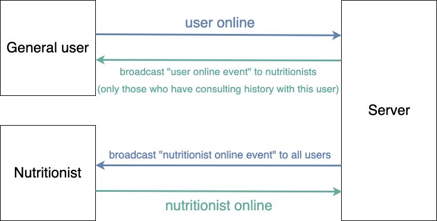
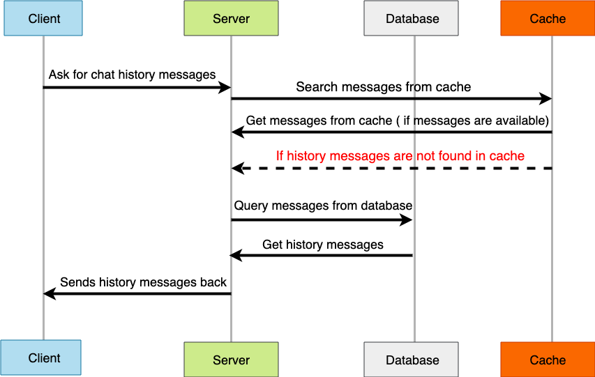

# Macros Eat

  

Macros Eat aims to help you record your daily diet with personalized diet plans focusing on macronutrients and provide consulting service chatting with nutritionist online in real-time. 

🖥️ Website URL : https://www.macroseat.xyz/

Test account and password : test@gmail.com / wayne123WAYNE

## Demo
- Select a day to load in your diet plan and starts to manage your food, diet plan and diet record.

- User can chat with nutritionist online in real-time or leave a message.  
Supports detecting typing event and showing unread message reminder. 

## Table of Contents

- [Main Features](#main-features)
- [Backend Technique](#backend-technique)
  - [Deployment](#deployment)
  - [Language / Web Framework](#language--web-framework)
  - [WSGI Server](#wsgi-server)
  - [AWS Cloud Service](#aws-cloud-service)
  - [Database](#database)
  - [Networking](networking)
  - [Third Party Library](#third-party-library)
  - [Version Control](#version-control)
  - [Key Points](#key-points)
- [Architecture](#architecture)
  - [Server Architecture](#server-architecture)
  - [Socket Architecture](#socket-architecture)
- [Database Schema](#database-schema)
- [Frontend Technique](#frontend-technique)
- [API Doc](#api-doc)
- [Contact](#contact)

## Main Features

- Setup CI/CD pipeline with github action and AWS ECR / CodeDeploy.
- Memebr System 
  - User can sign in locally or with Google account (OAuth2.0).
  - User authentication with Json Web Token. 
- Diet Record Features
  - User can customize personalized food and diet plans based on individual needs.
  - Supports searching for all food existing in this website.
  - Visualize macronutrients consuming status.
  - Supports recording daily weight.
- Online Consulting Service 
  - live chat with nutritionist online.
  - Showing online/offline status of general user and nutritionist.
  - Showing the number of unread messages. 
  - Supports tracing historical messages.
  - User can see all nutritionists but nutritionists can only see users who have consulting history with them.
  - Web notification on receiving message.
### Backend Technique

#### Deployment
- Containerize 
- docker-compose 

#### Language / Web Framework
- Python / Flask

#### WSGI Server
- Gunicorn

#### AWS Cloud Service
- EC2
- RDS
- S3, CloudFront
- ElastiCache
- Elastic Container Registry
- CodeDeploy

#### Database
- MySQL
- MongoDB
- Redis

#### Networking
- HTTP & HTTPS
- Domain Name System (DNS)
- NGINX
- SSL (Let's Encrypt)

#### Third Party Library
- Flask-SocketIO
- Celery
- oauthlib

#### Version Control
- Git/GitHub

#### Key Points
- Socket.IO

### Architecture

#### Server Architecture

#### Socket Architecture

- User and nutritionist get online. 
   

- Retrieving historical messages. 
   

- Send messages. 
   

## Database Schema

## Frontend Technique

- HTML
- JavaScript
- CSS
- AJAX
- Third Party Library
  - chart.js 
  - moment.js 
## API Doc

[API doc](https://app.swaggerhub.com/apis/mrwayne/macros-eat/1.0.0-oas3)
## Contact

👨🏻‍💻 許哲瑋 Che Wei Hsu 

📬 Email : whph60308@gmail.com
